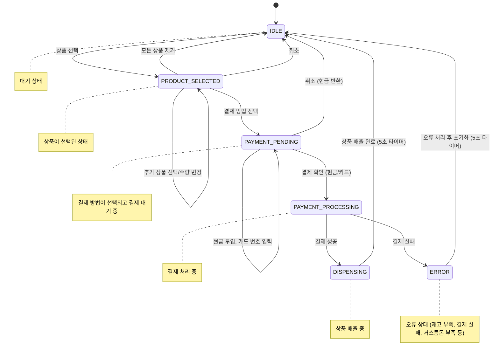

# Giwan Vending Machine 자판기 시뮬레이션 웹 앱

현재 버전 0.1.0
이 프로젝트는 사용자가 자판기에서 음료를 선택하고 결제하는 과정을 시뮬레이션 할 수 있는 웹 애플리케이션입니다.

## 자판기 상태 흐름 개요



## 기능

- 콜라, 물, 커피 선택 기능
  - 1종 이상의 음료 동시 선택
  - 1개 이상의 수량 동시 선택
- 상품 선택 후 현금 및 카드 결제 기능
- 디스플레이 패널 기능: 다양한 시뮬레이션 통상/예외 상황에 따른 상태 메시지 출력
- 스테이터스 패널 기능:
  - 구매 고객의 권종별 현금 보유 현황 표시
  - 구매 고객의 신용카드 한도 현황 표시
  - 자판기의 권종별 현급 보유 현황 표시
- 다양한 예외 상황 처리
  - 재고 부족
  - 카드 한도도 부족
  - 결제 실패
  - 거스름돈 계산 및 반환
- 카드 승인 거부 상황 강제 시뮬레이트 on/off 기능
- 음료 선택 상태 또는 결제 수단 선택 상태 중 취소 기능

## 개발 환경

- node.js 22.14.0 (npm 10.9.2)
- pnpm 10.10.0 (standalone script로 설치 됨)

## 기술 스택

- create-vite 도구로 최초 프로젝트 스캐폴딩
  - cli: `pnpm dlx create-vite gwin-vending-machine --template react-swc-ts`
  - vite 6.3.5
  - react 19.1.0
  - typescript 5.8.3
  - eslint 9.15.0
- prettier 전역 환경에 설치된 3.5.3

## CMDs

1. 패키지 설치:

   ```bash
   pnpm install
   ```

2. 애플리케이션 개발(HMR 개발 서버 `http://localhost:3000` 실행):

   ```bash
   pnpm dev
   ```

3. 패키지 빌드:
   ```bash
   pnpm build
   ```

## 프로젝트 구조

```
src/
  ├── components/                   # 리액트 컴포넌트
  │   ├── VendingMachine.tsx        # 자판기 메인 컴포넌트
  │   ├── ProductSelection.tsx      # 상품 선택 컴포넌트
  │   ├── DisplayPanel.tsx          # 디스플레이 패널 컴포넌트
  │   └── PaymentPanel.tsx          # 결제 패널 컴포넌트
  ├── models/                       # 타입 정의 및 인터페이스
  │   ├── Product.ts                # 상품 모델
  │   ├── Payment.ts                # 결제 모델
  │   └── VendingMachine.ts         # 자판기 상태 모델
  ├── services/                     # 비즈니스 로직
  │   └── VendingMachineService.ts  # 자판기 서비스 클래스
  ├── styles/                       # 스타일시트
  │   ├── App.css
  │   ├── DisplayPanel.css
  │   ├── index.css
  │   ├── ProductSelection.css
  │   └── PaymentPanel.css
  │   ├── VendingMachine.css
  ├── App.tsx                       # 애플리케이션 컴포넌트
  └── index.tsx                     # 애플리케이션 엔트리 포인트
```

## 구현된 예외 케이스

1. **재고 관리**

   - 재고가 없는 상품 선택 시 오류 메시지 표시
   - 실시간 재고 확인 및 업데이트
   - 여러 상품 동시 구매 시 모든 상품의 재고 확인

2. **결제 관련**

   - **현금 결제**
     - 투입 금액이 부족한 경우 추가 금액 투입을 기다림
     - 권종별 현금 보유량 부족 시 해당 권종 투입 불가
     - 거스름돈 계산 및 반환 (큰 단위부터 우선 사용)
     - 거스름돈 부족 시 결제 취소 및 투입 금액 반환
     - 현금 투입 및 거스름돈 반환 시 사용자 보유 현금 실시간 업데이트
   - **카드 결제**
     - 카드 결제 성공/실패 처리
     - 카드 한도 초과 시 결제 거부
     - 카드 승인 거부 시 5초후 자동 초기화

3. **취소 처리**

   - 상품 선택 후 취소 처리
   - 결제 진행 중 취소 및 투입 현금 반환
   - 카드 결제 진행 중 취소

4. **오류 복구**

   - 결제 실패 후 자동 상태 복구 (5초 타이머)
   - 거스름돈 부족 시 에러 처리 및 자동 복구
   - 상품 배출 오류 감지 및 처리

5. **사용자 인터페이스**

   - 통상 케이스에 대한 상태 메시지 출력
   - 오류 상태 메시지 출력
   - 결제 성공 및 음료 배출 메시지 출력

## 추가할 예외 케이스

- 동전 투입시 걸림
- 지폐 투입시 걸림
- 동전 반환시 걸림
- 지폐 반환시 걸림림
- 가짜 동전 투입
- 가짜 지폐 투입
- 가짜 카드 투입
- 상품 배출 걸림
